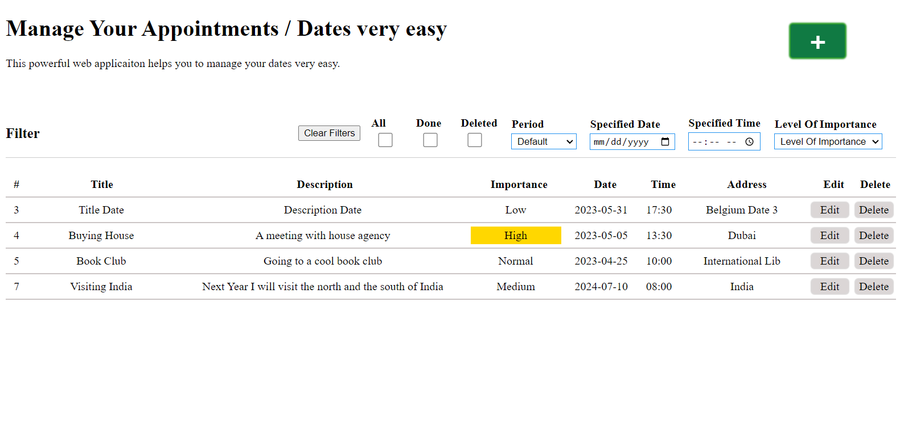
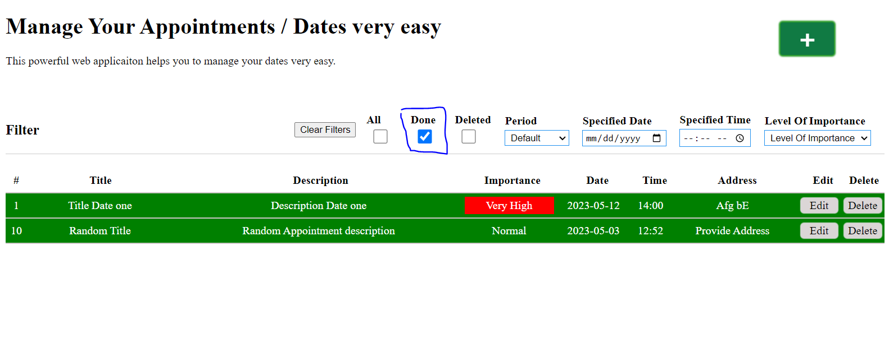

# 📅 Manage Your Appointments or Dates  

This is a **full-featured web application** built with **ASP.Net Web API** and **React.js** to manage dates, appointments, or similar scheduling needs.  

---

## 🚀 Features  

- **User-friendly** interface for managing appointments  
- **Secure & Scalable** backend using **ASP.Net Web API**  
- **Modern UI** built with **React.js**  
- **Database integration** with customizable connection strings  

---

## 📌 Setup Guide  

### 🛠️ Prerequisites  

- **.NET SDK** (for ASP.Net Web API)  
- **Node.js & npm** (for React.js frontend)  
- **SQL Server** (or any compatible database)  

---

### 🔧 Backend Setup (ASP.Net Web API)  

1. **Set up the database**  
   - Configure the **connection string** in `appsettings.json`  
   - Update the database name if necessary  

2. **Install dependencies**  
   - Open the project in **Visual Studio**  
   - Check and install required NuGet packages  

3. **Run the API**  
   - Start the **ASP.Net Web API** project from Visual Studio  

---

### 🎨 Frontend Setup (React.js)  

1. **Navigate to the client app folder**  
   ```sh
   cd ClientApp


## The landing page



## Filtered appointments(Done)



## Filtered appointments(Deleted)


### You have also other options to filter appointments like filtering based on dates, time, flags(level of importance),...


